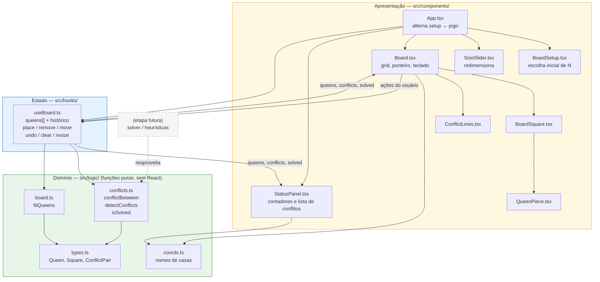

# Arquitetura da aplicação

Documento de apoio à entrega: como o projeto está organizado, quais são seus
componentes, como o tabuleiro e as rainhas são representados, e como os
conflitos são verificados.

## 1. Visão geral

A aplicação é um SPA (*single-page application*) React + TypeScript, servida
pelo Vite. Não há back-end, banco de dados nem chamadas de rede: todo o estado
vive na memória do navegador.

A organização segue três camadas com uma dependência estritamente unidirecional
— a interface conhece a lógica, mas a lógica não conhece a interface:

| Camada | Pasta | Responsabilidade | Depende de React? |
| --- | --- | --- | --- |
| **Domínio** | `src/logic/`, `src/types.ts` | Regras do problema: o que é um conflito, o que acontece ao redimensionar, como se nomeia uma casa | **Não** |
| **Estado** | `src/hooks/useBoard.ts` | Guarda as rainhas, aplica as operações (colocar, remover, mover, desfazer) e deriva os conflitos | Sim |
| **Apresentação** | `src/components/`, `src/App.tsx` | Desenha o tabuleiro, traduz cliques/teclas em operações | Sim |

O motivo dessa separação é o próximo passo da disciplina. Quando entrarem os
algoritmos de otimização (backtracking, subida de encosta, algoritmos
genéticos), o solver vai precisar avaliar milhares de configurações por segundo
— e não pode fazer isso montando componentes React. Com o domínio isolado em
funções puras, o solver importa `detectConflicts` diretamente e roda fora da
árvore de renderização, ou até num Web Worker.

## 2. Diagrama



**Fluxo de dados unidirecional:** o usuário age sobre o `Board`, que chama uma
função do `useBoard`; o hook atualiza `queens[]`, recalcula os conflitos com a
camada de domínio e devolve o novo estado; React redesenha `Board` e
`StatusPanel`. Nenhum componente guarda cópia própria das rainhas — existe uma
única fonte de verdade.

## 3. Representação do tabuleiro e das rainhas

### O tabuleiro não é armazenado

Não existe matriz `N × N` em memória. O tabuleiro é definido por um único
número, `n`, e é reconstruído na renderização (`Array.from({ length: n * n })`).
A cor de cada casa é derivada da paridade `(row + col) % 2`.

### As rainhas são uma lista esparsa

```ts
interface Queen {
  id: string;    // "q1", "q2", ... — identidade estável
  row: number;   // 0 = topo
  col: number;   // 0 = esquerda
}

type Estado = Queen[];   // no máximo n elementos
```

Três decisões merecem justificativa:

**Por que lista e não matriz `boolean[][]`?** O tabuleiro tem no máximo `n`
rainhas em `n²` casas — ou seja, é sempre esparso. Percorrer a lista custa
`O(n)`; varrer a matriz custa `O(n²)`. Além disso, a detecção de conflitos
precisa comparar *pares de rainhas*, e a lista já entrega exatamente isso.

**Por que não o vetor de permutação `col[row]`?** É a representação clássica
dos solvers, e ela embute a restrição "uma rainha por linha", o que elimina de
saída os conflitos de linha. Mas esta etapa exige justamente permitir posições
inválidas, inclusive duas rainhas na mesma linha, para que o usuário *veja* o
conflito. O vetor de permutação seria incapaz de representar esse estado. Ele
continua sendo a representação certa para a etapa de otimização, e a conversão
entre as duas é trivial (`queens.map(q => q.col)` quando a configuração já tem
uma rainha por linha).

**Por que `id` em vez de usar a posição como chave?** A posição muda durante o
arrasto. Com `id` estável, React mantém o mesmo elemento DOM e a animação de
movimento não pisca; e `move(id, casa)` fica bem definido mesmo que a casa de
destino esteja sendo disputada.

### Origem das coordenadas

Internamente `row 0` é o **topo** (ordem natural de renderização em HTML). Para
o usuário, `src/logic/coords.ts` converte para notação de xadrez, onde a linha 1
é a de baixo: `rankLabel(row, n) = n - row`. Essa conversão fica confinada a um
único arquivo — o resto do código nunca precisa pensar nela.

## 4. Verificação de conflitos

Toda a regra está em `src/logic/conflicts.ts`, em funções puras.

### O predicado

Duas rainhas se atacam se compartilham linha, coluna ou diagonal. Distância não
importa e nenhuma peça bloqueia o ataque — o tabuleiro só contém rainhas.

```ts
export function conflictBetween(a: Queen, b: Queen): ConflictKind | null {
  if (a.row === b.row) return 'linha';
  if (a.col === b.col) return 'coluna';
  if (Math.abs(a.row - b.row) === Math.abs(a.col - b.col)) return 'diagonal';
  return null;
}
```

O teste da diagonal é o ponto não óbvio: duas casas estão na mesma diagonal
quando o deslocamento vertical e o horizontal têm o **mesmo módulo** — o
movimento diagonal anda uma linha para cada coluna, então a razão é sempre 1.
Isso cobre as duas diagonais de uma vez: a descendente satisfaz
`row − col` constante e a ascendente `row + col` constante, e ambas colapsam em
`|Δrow| == |Δcol|`.

A função devolve o *tipo* do conflito, não apenas `true`. Isso alimenta a
mensagem exibida ao usuário (`b3 × d1 · diagonal`) — o objetivo pedagógico é
explicar o conflito, não só sinalizá-lo.

### A varredura

```ts
export function detectConflicts(queens: Queen[]): ConflictPair[] {
  const pairs: ConflictPair[] = [];
  for (let i = 0; i < queens.length; i++) {
    for (let j = i + 1; j < queens.length; j++) {
      const kind = conflictBetween(queens[i], queens[j]);
      if (kind) pairs.push({ a: queens[i], b: queens[j], kind });
    }
  }
  return pairs;
}
```

Comparação par a par, com `j = i + 1` para não testar o mesmo par duas vezes nem
comparar uma rainha consigo mesma: `C(n,2) = n(n−1)/2` comparações, ou seja
`O(n²)`. Com `n ≤ 16` são no máximo 120 comparações por atualização —
irrelevante para a interface, que recalcula tudo do zero a cada mudança em vez
de manter estado incremental.

Existe a alternativa `O(n)` com três conjuntos de contadores (por linha, por
`row − col` e por `row + col`), que é o que um solver usa. Ela foi
deliberadamente **não** adotada aqui: só devolve *quantos* conflitos existem,
não *quais pares* se atacam, e é exatamente a lista de pares que a interface
precisa para desenhar as linhas e listar as ocorrências. A troca vale a pena na
etapa de otimização, dentro do solver, onde só o número importa.

### Derivados

- `conflictingIds(pairs)` → `Set<string>` com os ids envolvidos em pelo menos um
  conflito; é o que pinta as rainhas de vermelho, em `O(1)` por casa.
- `isSolved(queens, n)` → as `n` rainhas colocadas **e** zero conflitos.

No `useBoard`, ambos são `useMemo` sobre `queens`: recalculam quando, e somente
quando, as rainhas mudam.

## 5. Operações sobre o estado

Todas passam pelo mesmo combinador `apply(fn)` em `useBoard.ts`:

```ts
const apply = (fn: (queens: Queen[]) => Queen[] | null) => { ... };
```

`fn` recebe as rainhas atuais e devolve as novas — ou `null` para "operação
inválida, nada muda". Esse `null` unifica todas as recusas (colocar além do
limite de `n`, mover para casa ocupada, mover para a mesma casa, limpar um
tabuleiro já vazio) num único ponto, e garante que uma tentativa sem efeito não
suje o histórico de desfazer. O histórico é uma pilha de snapshots
(`Queen[][]`), limitada a 50 entradas.

Duas regras que é importante não confundir:

- **Movimento é livre.** `move` só verifica se a casa de destino está vazia —
  nunca se o destino cria conflito. O problema das N rainhas se importa com a
  configuração final, não com o caminho.
- **Conflito é regra de xadrez.** Avaliado sobre a posição resultante, e apenas
  reportado ao usuário; nunca impede a jogada.

`resize(n)` usa `fitQueens` (`src/logic/board.ts`) para preservar as rainhas que
ainda cabem no novo grid e descarta o histórico, já que os estados anteriores
pertencem a um tabuleiro de outra dimensão.

## 6. Testes

`npm test` — 26 casos em Vitest, todos sobre a camada de domínio (`conflicts.ts`
e `board.ts`). Não há teste de componente: por serem funções puras, as regras do
problema se testam sem DOM, sem *mock* e sem renderização. Os casos cobrem os
três tipos de conflito, ambas as diagonais, tabuleiro vazio, rainha isolada,
conflito múltiplo, e o corte de rainhas ao encolher o tabuleiro.

## 7. Ponto de extensão para a próxima etapa

O contrato que os algoritmos de otimização vão consumir já existe e já está
testado:

| O que o solver precisa | O que já existe |
| --- | --- |
| Função de avaliação / custo | `detectConflicts(queens).length` |
| Teste de objetivo | `isSolved(queens, n)` |
| Aplicar uma solução na tela | `Queen[]` — o mesmo formato que o hook já usa |
| Rodar sem tocar na interface | `src/logic/` não importa React |

A previsão é acrescentar `src/logic/solvers/` ao lado de `conflicts.ts`, e no
`useBoard` uma ação que substitua `queens` pelo resultado do solver. Nenhuma
alteração nas camadas de apresentação ou de domínio existentes deve ser
necessária.
