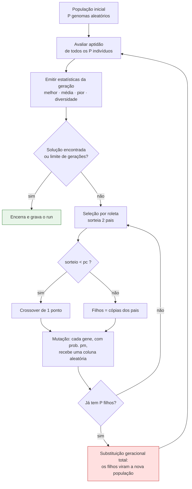

# Proposta de solução: algoritmo genético canônico

Documento de intenção da próxima etapa do projeto. Explica **o que** vai ser construído e,
principalmente, **por que cada escolha foi feita dessa forma e não de outra**.

Divisão de papéis entre os documentos do repositório:

| Documento | Responde |
| --- | --- |
| `README.md` | como rodar e como usar |
| `ARQUITETURA.md` | como o código está organizado (o "como") |
| **`SolutionPurpose.md`** | **por que a solução é essa (o "porquê")** |

---

## 1. O ponto de partida

O app hoje é um tabuleiro **manual**. O usuário escolhe N, posiciona as rainhas, arrasta, e
o app aponta os conflitos — sem resolver nada. `ARQUITETURA.md` §7 já reservou o espaço
desta etapa: o domínio está em `src/logic/` como funções puras, sem React, e serve de
**oráculo de teste** para o que vem agora. O solver não reaproveita `detectConflicts` nem
`isSolved` — ele usa um caminho O(n) próprio, validado contra os dois (seção 5). O que
atravessa a fronteira entre o domínio e o AG é `Queen[]`, o formato de troca que já existe e
já está testado.

Esta etapa preenche esse espaço com um **algoritmo genético canônico**.

## 2. Por que algoritmo genético

Sejamos honestos sobre isso, porque a honestidade aqui é o que dá valor ao trabalho:
**o problema das N rainhas não precisa de um algoritmo genético.** Existe construção
direta em O(n) que produz uma solução para qualquer n ≥ 4 sem busca nenhuma, e o
backtracking resolve n=8 instantaneamente.

A escolha é **didática e experimental**, não de desempenho. O problema é o banco de provas
ideal para um AG porque reúne quatro propriedades raras juntas:

1. **Espaço de busca combinatório e grande** — nesta representação, `n^n`; para n=8 são
   16.777.216 configurações, o que já derruba a força bruta.
2. **Função de aptidão barata, natural e graduada** — "quantos pares de rainhas se atacam"
   não é um sim/não, é um número que decresce suavemente rumo ao ótimo. AG precisa
   exatamente disso: um gradiente que a seleção possa escalar.
3. **Ótimo conhecido** — vale `n(n−1)/2`. Dá pra afirmar com certeza se o algoritmo
   acertou, o que quase nunca acontece em problemas reais de otimização.
4. **Visualizável** — um cromossomo *é* um tabuleiro. A evolução da população pode ser
   vista casa por casa, não só num gráfico abstrato.

O objetivo da entrega, portanto, não é "resolver o tabuleiro". É **medir o comportamento do
AG** e conseguir responder com dados a perguntas como *"taxa de mutação 0,02 ou 0,2 resolve
n=12 em menos gerações?"*. Daí a bancada de experimentos da seção 9.

## 3. O vocabulário mapeado no problema

Termo do AG à esquerda, o que ele significa concretamente aqui à direita:

| Termo do AG | No problema das N rainhas |
| --- | --- |
| **Indivíduo** | uma configuração inteira do tabuleiro, uma candidata a solução |
| **Cromossomo** / **genoma** | o vetor de N números que codifica essa configuração |
| **Gene** | uma posição do vetor, ou seja, uma **linha** do tabuleiro |
| **Alelo** | o valor daquele gene, ou seja, a **coluna** onde a rainha daquela linha está |
| **Genótipo** | o vetor `[3, 1, 3, 2, 5, 5, 0, 4]` |
| **Fenótipo** | o desenho correspondente no tabuleiro |
| **População** | o conjunto de indivíduos vivos ao mesmo tempo (padrão: 100) |
| **Geração** | uma iteração completa: avaliar → selecionar → cruzar → mutar → substituir |
| **Aptidão** (*fitness*) | quão boa é a configuração; aqui, pares de rainhas que **não** se atacam |
| **Pressão seletiva** | o quanto os melhores são favorecidos na hora de gerar filhos |
| **Convergência prematura** | a população vira quase-cópias antes de achar o ótimo e a busca trava |

## 4. Representação: vetor livre com codificação inteira

O cromossomo é um vetor de N inteiros onde **o índice é a linha e o valor é a coluna**:

```
genoma = [3, 1, 3, 2, 5, 5, 0, 4]        n = 8
          ↑                    ↑
     linha 0, coluna 3     linha 7, coluna 4
```

Valores **podem repetir** — daí "livre". No exemplo, as linhas 0 e 2 estão ambas na coluna
3, e as linhas 4 e 5 ambas na coluna 5. São conflitos reais, e é isso que o AG tem que
aprender a eliminar.

### O que essa escolha implica

Ter uma rainha por linha está embutido na estrutura: como cada índice existe uma única vez,
**conflito de linha é impossível por construção**. Sobram dois tipos:

- **coluna** — dois genes com o mesmo valor
- **diagonal** — a regra clássica, `|Δlinha| == |Δcoluna|`

Isso significa que a lista de conflitos exibida ao usuário durante uma execução do AG nunca
conterá o tipo `linha`. Não é um defeito da detecção: é uma consequência da representação, e
vale ter isso claro ao ler a tela.

### Por que não a representação por permutação

A alternativa clássica da literatura é exigir valores **distintos** (uma permutação de
`0..n−1`), o que elimina também os conflitos de coluna e deixa só as diagonais. Ela reduz o
espaço de busca de `n^n` para `n!` — para n=8, de 16,7 milhões para 40.320, quatrocentas
vezes menor — e converge muito mais rápido.

Foi deliberadamente **rejeitada**, por três motivos:

1. **A permutação resolve parte do problema fora do AG.** Ela embute uma restrição por
   engenharia da representação, não por evolução. O trabalho é sobre o AG; entregar a ele
   um problema já parcialmente resolvido esvazia a demonstração.
2. **Ela obriga a abandonar os operadores canônicos.** Crossover de 1 ponto entre duas
   permutações produz filhos com valores repetidos, ou seja, inválidos — seria preciso
   trocar para OX, PMX ou CX, e a mutação teria que virar troca de posições. Como a decisão
   desta entrega é usar o AG **canônico**, a permutação é incompatível com ela.
3. **O tabuleiro do app aceita qualquer configuração.** A etapa manual foi construída
   justamente para permitir posições inválidas e mostrá-las. A representação livre conversa
   com isso; a permutação seria incapaz de representar metade dos estados que o app já sabe
   desenhar.

### Por que codificação inteira, e não binária

O AG de Holland (1975) usa cadeias de **bits**. A tradução literal aqui seria
`ceil(log₂ n)` bits por gene — para n=8, três bits por gene, cromossomo de 24 bits, mutação
por *bit-flip*, e o corte do crossover podendo cair no meio de um gene.

O problema aparece quando **n não é potência de 2**. Para n=12 seriam 4 bits, com alelos de
0 a 15 — e as colunas 12 a 15 não existem no tabuleiro. Seria preciso enxertar uma etapa de
reparo (módulo n) ou de descarte, o que é *mais* distante do canônico do que simplesmente
usar um alfabeto maior.

A codificação inteira mantém a estrutura canônica intacta (mesma seleção, mesmo crossover,
mesma mutação, apenas sobre um alfabeto de tamanho n em vez de 2) e garante que **todo
cromossomo é sempre válido**, em qualquer ponto do processo, sem nenhum reparo.

## 5. A função de aptidão

Contamos os pares de rainhas que se atacam e chamamos isso de **colisões**. O total de
pares possíveis é `C(n,2) = n(n−1)/2` — para n=8, vinte e oito. Então:

```
maxFitness(n) = n(n−1)/2
fitness(genoma) = maxFitness(n) − colisões(genoma)
```

Aptidão é o número de pares **em paz**. É sempre ≥ 0 — requisito da seleção por roleta, que
não sabe lidar com valores negativos — e o ótimo global é `maxFitness(n)`, atingido apenas
quando não existe nenhuma colisão.

Exemplo com o genoma da seção 4:

```
genoma = [3, 1, 3, 2, 5, 5, 0, 4]

colunas iguais:           linhas 0 e 2 (col 3), linhas 4 e 5 (col 5) → 2 colisões
diagonal ↘ (i − col + 7): 4, 7, 6, 8, 6, 7, 13, 10  → 6 e 7 repetem   → 2 colisões
diagonal ↗ (i + col):     3, 2, 5, 5, 9, 10, 6, 11  → o 5 repete      → 1 colisão

colisões = 5        fitness = 28 − 5 = 23
```

E uma solução perfeita:

```
genoma = [0, 4, 7, 5, 2, 6, 1, 3]
colunas, diagonais ↘ e diagonais ↗: todos os valores distintos
colisões = 0        fitness = 28    ← ótimo
```

### Por que o solver não reaproveita `detectConflicts`

`detectConflicts` (`src/logic/conflicts.ts`) já calcula exatamente isso e já está testada.
Mas ela é O(n²) e **aloca um objeto por par em conflito**, porque a interface precisa saber
*quais* rainhas se atacam para desenhar as linhas vermelhas e listar os pares.

O AG não precisa de nada disso: precisa só do **número**, e precisa dele cem mil vezes por
execução (100 indivíduos × 1000 gerações). A versão do solver roda em **O(n)** com três
arrays de contadores — coluna, diagonal ↘ e diagonal ↗ — somando `C(k,2)` para cada
grupo com k rainhas.

Um detalhe de índice, que é a fonte clássica de erro nesta implementação: `i − col` varia de
`−(n−1)` a `n−1`, ou seja, **é negativo em metade dos casos** e não serve como índice de
array cru. Soma-se `n − 1` para deslocar a faixa inteira para `0..2n−2`. Os arrays das duas
diagonais têm portanto tamanho `2n − 1`, e não `n`:

```
colunas:     contCol[col]               tamanho n
diagonal ↘:  contDesc[i - col + n - 1]  tamanho 2n - 1
diagonal ↗:  contAsc[i + col]           tamanho 2n - 1
```

É esse deslocamento que já está aplicado aos números do exemplo acima.

Os três grupos são **disjuntos**: duas rainhas não podem estar na mesma coluna *e* na mesma
diagonal (isso exigiria estarem na mesma linha, impossível aqui), nem nas duas diagonais ao
mesmo tempo (isso exigiria serem a mesma casa). Logo a soma é a contagem exata de pares, sem
dupla contagem.

Essa equivalência vira um **teste de invariante**: para genomas aleatórios,
`colisões(g)` tem que dar exatamente `detectConflicts(genomaParaRainhas(g)).length`. A
implementação rápida e nova é validada contra a implementação lenta e já testada.

## 6. O ciclo canônico



O bloco em vermelho é o que caracteriza o AG canônico e o que diferencia esta implementação
das versões modernas: **a população inteira é descartada e substituída pelos filhos**.
Ninguém sobrevive por mérito.

### Os operadores, um a um

**Seleção por roleta** (*fitness-proportionate selection*). Cada indivíduo recebe uma fatia
de uma roleta proporcional à sua aptidão; sorteia-se um ponto e vence quem ocupa aquela
fatia. Um indivíduo com aptidão 26 tem o dobro de chance de um com 13. Não é eliminação: o
pior indivíduo da população ainda tem chance não nula de gerar filhos, e é isso que preserva
diversidade genética.

> A seleção por **torneio** (sortear k indivíduos e ficar com o melhor) é hoje mais comum e
> mais estável, mas foi proposta bem depois de Holland e **não faz parte do AG canônico**.
> Fica de fora por decisão de escopo.

**Crossover de 1 ponto**, com probabilidade `pc`. Sorteia-se um ponto de corte e os filhos
herdam um pedaço de cada pai:

```
ponto de corte = 3

pai 1   [3, 1, 3 | 2, 5, 5, 0, 4]
pai 2   [7, 0, 2 | 6, 1, 4, 6, 3]
        ─────────────────────────
filho 1 [3, 1, 3 | 6, 1, 4, 6, 3]
filho 2 [7, 0, 2 | 2, 5, 5, 0, 4]
```

A aposta implícita do crossover é a **hipótese dos blocos construtivos**: se as três
primeiras linhas do pai 1 estão bem resolvidas entre si, esse bloco tende a sobreviver
inteiro e a se combinar com um bom bloco de outro pai. O corte em um único ponto favorece
essa preservação, porque genes vizinhos raramente são separados.

Vale notar a fragilidade dessa aposta neste problema: como uma rainha ataca à distância, a
linha 0 interage com a linha 7 tanto quanto com a linha 1. Não existe "vizinhança" real no
cromossomo, e por isso os blocos aqui são menos coesos do que a teoria pressupõe. É um dos
motivos pelos quais o AG canônico costuma perder para heurísticas mais simples neste
problema — e é uma observação que vale mais para a análise do que qualquer resultado bonito.

Quando o sorteio dá acima de `pc`, não há cruzamento: os filhos são cópias fiéis dos pais.

**Mutação**, com probabilidade `pm` **por gene**. Cada gene, independentemente, pode ser
trocado por uma coluna sorteada de `0..n−1`. É a única fonte de material genético novo
depois da população inicial: o crossover só recombina o que já existe, então sem mutação a
população perde variedade e nunca a recupera.

O ajuste de `pm` é o dial mais sensível do AG. Baixa demais, a busca estagna no primeiro
ótimo local; alta demais, os bons filhos são destruídos assim que aparecem e o AG degenera
em busca aleatória.

**Substituição geracional total.** Os P filhos formam a nova população, inteira. A geração
anterior deixa de existir.

## 7. O que este AG deliberadamente não tem

Esta seção é tão importante quanto as anteriores, porque cada ausência é uma escolha.

| Ausente | Por quê |
| --- | --- |
| **Elitismo** | decisão explícita de manter o AG canônico. Elitismo (copiar os melhores intactos para a geração seguinte) é uma adição posterior ao modelo de Holland |
| **Hall of fame** | não guardamos o melhor indivíduo já visto. Só existe o melhor **da geração corrente** |
| **Escala de aptidão** | roleta crua, sem *windowing* nem *sigma scaling* |
| **Seleção por torneio** | posterior ao canônico |
| **Representação por permutação** | ver seção 4 |
| **Backtracking, subida de encosta** | fora do escopo desta entrega |

## 8. As duas consequências assumidas

Ambas são comportamentos **corretos** do AG canônico. Nenhuma é defeito a corrigir, e as
duas são material de análise.

### 8.1 A curva do melhor oscila para baixo

Sem elitismo e com substituição total, **o melhor indivíduo da geração 40 pode simplesmente
não existir na geração 41**. Ele precisa ser sorteado como pai (a roleta o favorece, mas não
o garante), sobreviver ao crossover e escapar da mutação. Frequentemente não sobrevive.

O gráfico de aptidão, portanto, terá uma curva **serrilhada**, que sobe e desce, em vez da
escada monotônica que se costuma esperar de um otimizador.

> **Esse serrilhado é o principal produto pedagógico da entrega.** Ele mostra na tela, sem
> precisar de explicação teórica, o problema concreto que motivou a invenção do elitismo.

Vale separar duas coisas que se confundem com facilidade aqui:

- **A curva é afetada** pela falta de hall of fame. Cada ponto do gráfico é o melhor
  **daquela geração**, não o melhor já visto em toda a execução. É exatamente daí que vem o
  serrilhado.
- **A detecção da solução não é.** A verificação de `colisões == 0` acontece logo após
  avaliar cada geração, antes de qualquer reprodução. Uma solução que nasce na geração 41 é
  registrada na geração 41. Nenhuma solução se perde silenciosamente, e nesse ponto o
  critério de parada é idêntico ao de um AG com elitismo.

### 8.2 A roleta cega no fim da corrida

É o *scaling problem* clássico da seleção proporcional à aptidão.

**No começo**, as aptidões são muito desiguais (digamos, 12 contra 24) e a roleta favorece
fortemente os melhores — pressão seletiva alta, risco de convergência prematura.

**No fim**, quando quase toda a população já chegou perto do ótimo, as aptidões ficam
apertadas: 25, 26, 27 de um máximo de 28. A razão entre as fatias cai para 27/26 ≈ 1,04 — o
indivíduo quase perfeito tem 4% mais chance que um pior. A seleção vira praticamente um
sorteio uniforme, a pressão seletiva evapora e o AG passa a depender de sorte da mutação
para fechar as últimas colisões.

Existem correções conhecidas (*windowing*, `f' = f − f_mín`; ou *sigma scaling*, normalizar
pela média e pelo desvio padrão da população). Foram deixadas de fora: escondê-las tornaria
o algoritmo mais eficaz e a análise mais pobre. **O fenômeno aparecendo no gráfico vale mais
do que o fenômeno resolvido.**

## 9. A bancada de experimentos

Um AG rodado uma vez não prova nada: ele é estocástico, e a mesma configuração pode resolver
n=8 em 40 gerações numa execução e falhar em 1000 na seguinte. Qualquer afirmação sobre
parâmetros precisa de **repetição e estatística**.

Daí a segunda metade da entrega.

### Reprodutibilidade vem antes de tudo

`Math.random()` não aceita semente. Sem semente, nenhuma execução pode ser repetida, o
histórico registra resultados que ninguém consegue reproduzir e os testes automatizados do
AG não podem ser determinísticos.

Por isso entra um gerador pseudoaleatório próprio com semente (mulberry32, cerca de dez
linhas). Com ele, **mesma semente + mesmos parâmetros = exatamente a mesma evolução**, gene
por gene. É a fundação de todo o resto: sem isso, a bancada seria uma coleção de anedotas.

### O que fica registrado

Cada execução vira um registro persistente com os parâmetros usados (incluindo a semente), o
resultado (resolveu? em quantas gerações? qual a melhor aptidão? quanto tempo levou?), o
genoma final e a série completa de estatísticas geração a geração.

### A métrica de diversidade

O fluxograma da seção 6 emite `melhor · média · pior · diversidade` a cada geração. As três
primeiras são imediatas; a quarta precisa de definição, e ela não é decorativa:
**diversidade é a única métrica que prova a convergência prematura** da seção 3 e que dá
corpo ao *scaling problem* da seção 8.2. Sem ela, os dois fenômenos são afirmações sobre o
formato do gráfico, não medições.

A escolha é **entropia média por locus**. Para cada linha do tabuleiro monta-se o histograma
das colunas ocupadas por aquele gene em toda a população, calcula-se a entropia de Shannon e
normaliza-se por `log₂ n`; a diversidade da geração é a média das n entropias.

| Alternativa | Custo por geração | Problema |
| --- | --- | --- |
| Nº de genomas distintos | O(P·n) | grosseira: satura em P muito antes de a população convergir de fato |
| Distância de Hamming média entre pares | O(P²·n) ≈ 800 mil operações | cara demais para rodar a cada geração |
| **Entropia média por locus** | **O(P·n)** | — |

O valor cai em `[0, 1]`: começa perto de 1 na população inicial aleatória e desce rumo a 0
conforme os genes se uniformizam. Custa a mesma ordem que já se paga para avaliar a aptidão
da população inteira, então sai praticamente de graça.

### Modo lote

Roda a mesma configuração M vezes (M = 30, por exemplo), variando apenas a semente, e
consolida: **taxa de sucesso**, média e desvio padrão do número de gerações até a solução.

É o modo lote que permite afirmar algo defensável. Estes são números **medidos** pela
implementação, com população 100, `pc` = 0,8, limite de 1000 gerações e sementes 1 a 30:

| Configuração | Resolvidos | Taxa | Média de gerações | Desvio |
| --- | --- | --- | --- | --- |
| n = 8, `pm` = 0,02 | 28/30 | 93% | 340 | 251 |
| n = 8, `pm` = 0,2 | 14/30 | 47% | 414 | 296 |
| n = 6, `pm` = 0,02 | 28/30 | 93% | 164 | 231 |

Ou seja: **subir `pm` de 0,02 para 0,2 derruba a taxa de sucesso pela metade** — a mutação
alta destrói os bons filhos assim que eles aparecem, exatamente como a seção 6 previu. Uma
frase dessas exige trinta execuções, não uma.

Repare também no desvio padrão, quase do tamanho da média: a distribuição do número de
gerações é fortemente assimétrica. Alguns runs resolvem em algumas dezenas de gerações,
outros passam de 800. É mais um argumento contra tirar conclusão de uma execução só.

### Dois caminhos de execução, um só núcleo

Esta é a única restrição de arquitetura que o modo lote impõe, e vale registrá-la antes de
escrever a primeira linha do AG.

A seção 10 prevê a execução avançando por quadro de animação, o que é a escolha certa para
**ver** o AG evoluindo. Mas um lote de M = 30 execuções de até 1000 gerações são 30.000
gerações; a 60 quadros por segundo isso dá **500 segundos de relógio** — inviável. O mesmo
lote em um laço síncrono são cerca de 3 milhões de avaliações de aptidão O(n), que rodam em
poucos segundos. O gargalo nunca foi CPU: era o quadro de animação.

Logo são dois **consumidores**, não dois algoritmos:

| Caminho | Consome como | Para quê |
| --- | --- | --- |
| **Visual** | um passo por quadro de animação, pausável | ver as rainhas deslizando, uma execução |
| **Lote** | laço síncrono até o fim, sem render | M execuções, estatística |

O núcleo é, portanto, uma **função geradora pura** — algo como `function* evolve(params)`
dando `yield` das estatísticas de cada geração. O modo visual puxa um `yield` por quadro; o
modo lote consome tudo de uma vez em um `for...of`.

Isso não é preferência de estilo: é o que sustenta a reprodutibilidade. Como os dois modos
percorrem exatamente o mesmo gerador, eles consomem o PRNG **na mesma ordem**, e a mesma
semente produz a mesma evolução nos dois. Se o quadro de animação estivesse *dentro* do
algoritmo, o modo lote seria inviável e as duas execuções divergiriam.

Duas consequências práticas decorrem disso:

- **O PRNG não pode viver dentro de um componente React.** O StrictMode do React 19 executa
  efeitos duas vezes em desenvolvimento; um gerador consumido de dentro de um efeito daria
  resultados diferentes entre `dev` e `build`. O PRNG entra como parâmetro do núcleo puro e
  nunca é tocado pela camada de interface.
- **Isso vira teste.** Mesma semente, duas execuções, comparação profunda da série inteira:
  têm que ser idênticas. É o teste que protege a fundação de toda esta seção.

Web Worker fica de fora por ora. Se um lote de 30 execuções travar a interface por alguns
segundos, ele entra depois — sem alterar nada do que está acima, justamente porque o núcleo
já é puro.

### A faixa útil de n

O tabuleiro aceita `n` de 1 a 16 (`MAX_N`, em `src/types.ts`). O AG canônico, com população
100 e 1000 gerações, **não** produz sinal útil em toda essa faixa:

| Faixa | Medido (população 100, `pm` = 0,02, 1000 gerações) |
| --- | --- |
| n = 4 a 8 | **28/30 em n=8** e 28/30 em n=6 — taxa alta e sensível aos parâmetros. **É aqui que o experimento tem sinal** |
| n = 10 | **1/15.** Já quase morto: serve para mostrar a queda, não para comparar parâmetros |
| n ≥ 12 | **0/10 em n=12, 0/5 em n=16.** O espaço de busca chega a `16^16 ≈ 1,8 × 10¹⁹` e o *scaling problem* da seção 8.2 morde muito antes do ótimo |

**Isso não é defeito, é o resultado.** É a confirmação empírica do que a seção 2 já antecipa:
o AG canônico perde para heurísticas muito mais simples neste problema. E a queda é mais
abrupta do que se imaginaria — entre n=8 e n=10 a taxa despenca de 93% para 7%, sem meio
termo. Mas precisa estar escrito, porque um lote rodado em n=16 devolve 0/30 e a leitura
ingênua disso é "o código está quebrado". O padrão do modo lote é, por isso, **n = 8**.

### Onde os dados ficam

Em **IndexedDB**, o banco de dados embutido no navegador. A série completa de mil gerações
ocupa cerca de 30 KB por execução, e algumas centenas de execuções passariam do teto de
~5 MB do `localStorage`. O IndexedDB não tem esse limite prático, é transacional, aceita
índices por N e por data, e **não exige nenhuma dependência nova** — o projeto continua com
apenas `react` e `react-dom`.

Há um detalhe que fecha um ciclo com uma decisão antiga: o IndexedDB **não funciona sob
`file://`**. O pacote desktop `ClickAndGo` já serve o app por `http://localhost` — decisão
tomada por causa do bloqueio de módulos ES, documentada no `README.md`. Ela agora paga um
segundo dividendo, sem nenhuma alteração.

Complementando o banco, **exportar e importar JSON**: um arquivo com todo o histórico, que
pode ser anexado ao relatório, versionado ou levado para outra máquina.

## 10. Parâmetros e critérios de parada

| Parâmetro | Padrão | Observação |
| --- | --- | --- |
| Tamanho da população | 100 | |
| Taxa de crossover `pc` | 0,8 | faixa canônica: 0,6 a 0,9 |
| Taxa de mutação `pm` | 0,02 por gene | o dial mais sensível; principal alvo dos experimentos |
| Máximo de gerações | 1000 | |
| Semente | editável | mesma semente reproduz a execução inteira |

Todos ajustáveis na interface — são eles o objeto de estudo.

A execução para quando a aptidão máxima é atingida (`solved`) ou quando o limite de gerações
é alcançado. No **modo visual** as gerações avançam **uma ou mais por quadro de animação**, o
que mantém a interface responsiva, permite pausar, avançar passo a passo, e mostra as rainhas
deslizando pelo tabuleiro conforme a população evolui. O **modo lote** consome o mesmo núcleo
sem quadro nenhum — ver seção 9, "Dois caminhos de execução, um só núcleo".

### Casos de borda que o algoritmo precisa tratar

- **n = 1** — a aptidão máxima é 0 e toda a população já nasce ótima. Resolve na geração 0.
- **n = 2 e n = 3** — **não possuem solução.** O AG roda até o limite e registra o run como
  não resolvido. Excelente caso de teste: valida que o algoritmo sabe desistir.
- **Aptidão total zero** — se toda a população tem aptidão 0 (possível em n=2), a roleta
  dividiria por zero. Nesse caso ela cai em sorteio uniforme.

## 11. Resumo das decisões

| Item | Escolha | Razão em uma linha |
| --- | --- | --- |
| Representação | vetor livre `genoma[linha] = coluna` | todo cromossomo é válido, sem reparo |
| Codificação | inteira | mantém o canônico intacto para qualquer n |
| Aptidão | `C(n,2) − colisões` | sempre ≥ 0, como a roleta exige |
| Custo | O(n) com contadores | cem mil avaliações por execução |
| Seleção | roleta pura | canônico ao pé da letra |
| Crossover | 1 ponto, `pc` | canônico |
| Mutação | por gene, `pm` | canônico com alfabeto de tamanho n |
| Substituição | geracional total | canônico |
| Elitismo | nenhum | decisão explícita |
| Hall of fame | nenhum | a curva mostra o melhor da geração, não o melhor já visto |
| Escala de aptidão | nenhuma | o *scaling problem* deve aparecer, não ser escondido |
| Aleatoriedade | PRNG com semente | sem reprodutibilidade não há experimento |
| Persistência | IndexedDB, sem dependência nova | série completa, sem teto de 5 MB |
| Diversidade | entropia média por locus | mede a convergência prematura em vez de só afirmá-la |
| Execução | núcleo gerador puro; quadro de animação só no consumidor visual | mesma semente vale nos dois modos, e o lote roda sem render |

---

**Estado deste documento:** o núcleo do AG está implementado em `src/logic/ga/` (PRNG,
aptidão O(n), operadores, o gerador `evolve` e o modo lote), coberto por testes, e os números
da seção 9 são medidos por ele. Falta a camada de interface: persistência em
IndexedDB, gráficos e os controles de parâmetros.
